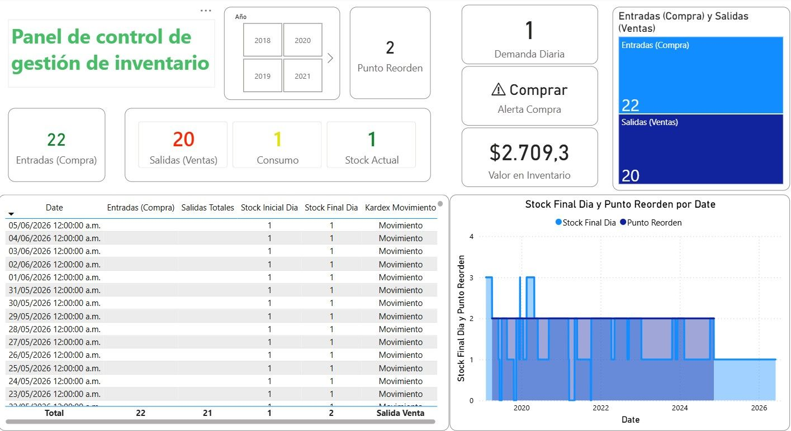
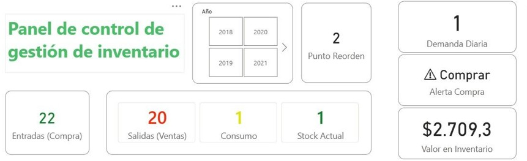
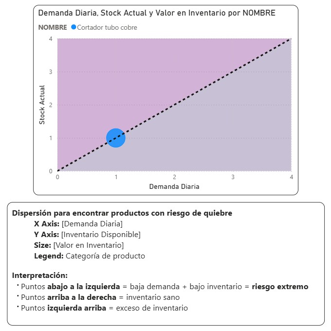

# 📊 Dashboard de Análisis de Inventarios - Power BI

Dashboard de análisis de inventarios desarrollado en Power BI para identificar riesgos de desabastecimiento y monitorear puntos de reorden.

## Descripción General

Este proyecto fue desarrollado para monitorear los niveles de inventario e identificar productos con riesgo de quiebre de stock mediante análisis de inventarios y seguimiento de puntos de reorden.

El dashboard apoya la toma de decisiones de compra y reabastecimiento al proporcionar visibilidad sobre los niveles de inventario, la demanda y el estado de los productos.

---

## Problema de Negocio

La falta de inventario puede afectar la continuidad operativa, la satisfacción de los clientes y el desempeño de las ventas.

El objetivo de este proyecto fue crear un dashboard capaz de:

* Monitorear los niveles de inventario.
* Dar seguimiento a la demanda diaria.
* Identificar riesgos de desabastecimiento.
* Apoyar las decisiones de reabastecimiento.
* Generar alertas de compra.

---

## Vista General del Dashboard

---

## Indicadores Clave de Desempeño (KPIs)

El dashboard incluye:

* Inventario Actual
* Demanda Diaria
* Punto de Reorden
* Valor del Inventario
* Alerta de Compra
* Análisis de Entradas y Salidas

---

## Hallazgo Principal

El análisis identificó un producto con las siguientes características:

| Métrica           | Valor |
| ----------------- | ----- |
| Inventario Actual | 1     |
| Punto de Reorden  | 2     |
| Demanda Diaria    | 1     |

### Interpretación

El inventario actual del producto se encuentra por debajo del punto de reorden.

Considerando la demanda diaria observada, el inventario disponible podría agotarse aproximadamente en un día si no se realiza un reabastecimiento oportuno.

Esta situación representa un riesgo potencial de desabastecimiento.

---

## Recomendaciones de Negocio

### Corto Plazo

* Generar una orden de compra.
* Monitorear diariamente el nivel de inventario.

### Mediano Plazo

* Implementar políticas de stock de seguridad.
* Revisar las frecuencias de reabastecimiento.

### Largo Plazo

* Implementar modelos de pronóstico de demanda.
* Desarrollar una clasificación ABC de inventarios.
* Analizar la rotación de inventario.

---

## Herramientas Utilizadas

* Microsoft Excel
* Power BI
* DAX
* Modelado de Datos
* Visualización de Datos

---

## Documentación

La documentación del proyecto se encuentra disponible en la carpeta **Documentation**:

* Inventory_Dashboard_Case_Study.docx
* Inventory_Dashboard_Case_Study.pdf

---

## Mejoras Futuras

* Clasificación ABC
* Cálculo de Stock de Seguridad
* Pronóstico de Demanda
* Análisis de Desempeño de Proveedores
* Métricas de Rotación de Inventario

---

## Autor

Luis Fernando Guzmán Suárez
DATA ANALYST | EXCEL | POWER BI | SQL | Python | Estadística aplicada | Minería de datos | Lean Six Sigma Yellow Belt

